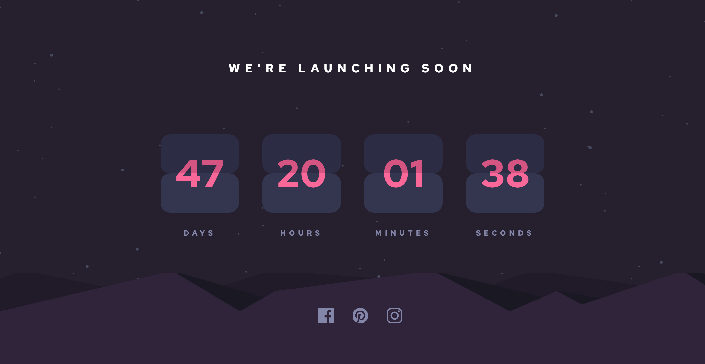

# Frontend Mentor - Launch countdown timer solution

This is a solution to the [Launch countdown timer challenge on Frontend Mentor](https://www.frontendmentor.io/challenges/launch-countdown-timer-N0XkGfyz-). Frontend Mentor challenges help you improve your coding skills by building realistic projects.

## Table of contents

- [Overview](#overview)
  - [The challenge](#the-challenge)
  - [Screenshot](#screenshot)
  - [Links](#links)
- [My process](#my-process)
  - [Built with](#built-with)
<<<<<<< HEAD
  - [Useful resources](#useful-resources)
- [Author](#author)
=======
  - [What I learned](#what-i-learned)
  - [Continued development](#continued-development)
  - [Useful resources](#useful-resources)
- [Author](#author)
- [Acknowledgments](#acknowledgments)
>>>>>>> 429bf26a52a50714c436e840ddef36aa9e502f6f

## Overview

### The challenge

Users should be able to:

- See hover states for all interactive elements on the page
- See a live countdown timer that ticks down every second (start the count at 14 days)
- **Bonus**: When a number changes, make the card flip from the middle

### Screenshot

### Links

- Solution URL: [Launch countdown timer](https://www.frontendmentor.io/solutions/react-js-postcss-y-flexbox-sF6CFkDlU)
- Live Site URL: [Launch countdown timer](https://codingleonardo.github.io/launch-countdown-timer/)

## My process

### Built with

- Semantic HTML5 markup
- CSS custom properties
- Flexbox
- [React](https://reactjs.org/) - JS library
- [PostCSS](https://postcss.org/) - CSS transpiler

### Useful resources

- [MDN Web Docs](https://developer.mozilla.org/en-US/docs/Web/CSS) - This helped me learn how filters work in css.

## Author

- Website - [Leonardo Rivero](https://codingleonardo.github.io/)
- Frontend Mentor - [@CodingLeonardo](https://www.frontendmentor.io/profile/CodingLeonardo)
- Twitter - [@CodingLeonardo](https://www.twitter.com/CodingLeonardo)
